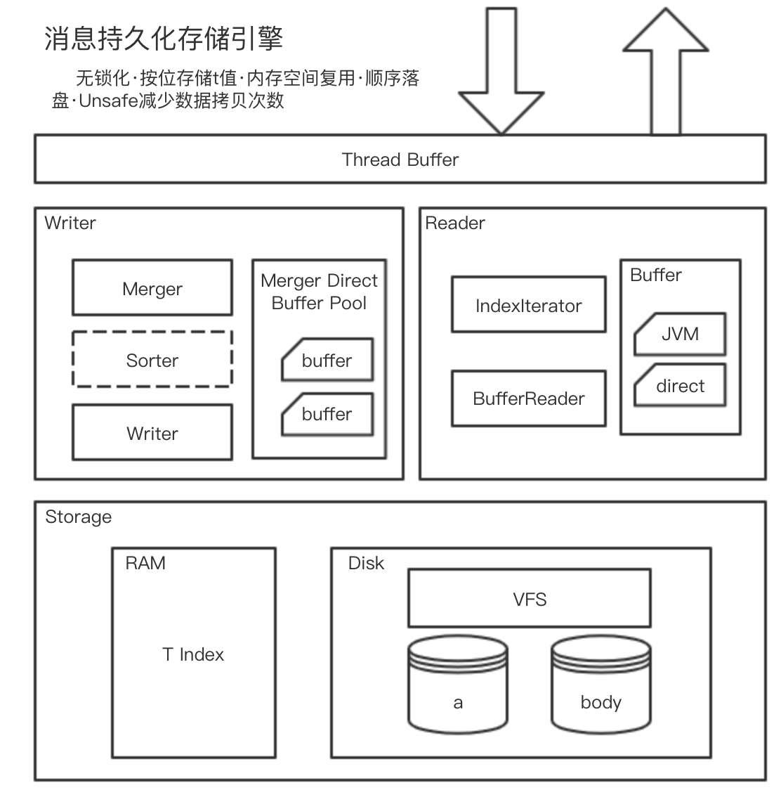

>写在前面: 
> 1.在开始coding前请仔细阅读以下内容

## 更新日志
* 如果没有符合条件的消息, MessageStore.getMessage返回大小为0的List, MessageStore.getAvgValue接口返回0
* 日志下载路径见成绩的评测日志链接; 接口参数说明; Jvm相关参数说明; ulimit -a值更新; getMessage单条线程最大返回消息数量不超过50万
* 不允许使用jni/jna, dio; getMessage返回结果中a不要求有序

## 1. 赛题描述
Apache RocketMQ作为的一款分布式的消息中间件，历年双十一承载了万亿级的消息流转，为业务方提供高性能低延迟的稳定可靠的消息服务。随着业务的逐步发展和云上的输出，各种依赖消息作为输入输出的流计算场景层出不穷，这些都给RocketMQ带来了新的挑战。请实现一个进程内消息持久化存储引擎，可支持简单的条件查询，以及支持简单的聚合计算，如指定时间窗口的内对于消息属性某些字段的求平均等。

## 2 题目内容
  实现一个进程内消息持久化存储引擎，要求包含以下功能：

    - 发送消息功能
    - 根据一定的条件做查询或聚合计算，包括
      A. 查询一定时间窗口内的消息
      B. 对一定时间窗口内的消息属性某个字段求平均

  例子：t表示时间，时间窗口[1000, 1002]表示: t>=1000 & t<=1002 (这里的t和实际时间戳没有任何关系, 只是一个模拟时间范围)

  对接口层而言，消息包括两个字段，一个是业务字段a，一个是时间戳，以及一个byte数组消息体。实际存储格式用户自己定义，只要能实现对应的读写接口就好。

  发送消息如下(忽略消息体)：

    消息1，消息属性{"a":1,"t":1001}
    消息2，消息属性{"a":2,"t":1002}
    消息3，消息属性{"a":3,"t":1003}

  查询如下：

    示例1-
        输入：时间窗口[1001，9999]，对a求平均
        输出：2, 即：(1+2+3)/3=2
    示例2-
        输入：时间窗口[1002，9999]，求符合的消息
        输出：{"a":1,"t":1002},{"a":3,"t":1003}
    示例3-
        输入：时间窗口[1000，9999]&（a>=2），对a求平均
        输出：2 (去除小数位)


## 3 语言限定
JAVA


## 4.  程序目标

仔细阅读demo项目中的MessageStore，DefaultMessageStoreImpl，DemoTester三个类。

你的coding目标是实现DefaultMessageStoreImpl

注：
评测时的数据存储路径为：/alidata1/race2019/data。
日志请直接打印在控制台标准输出，可以使用System.out.println，如果使用日志框架，请配置为ConsoleAppender。注意不要把日志输出到Error通道（也即不要使用System.err.println，如果使用日志框架，则不要使用log.error）。评测程序会把控制台标准输出的内容搜集出来，放置在OSS上面供用户排错，但是请不要密集打印日志，单次评测，最多不能超过100M，超过会截断


## 5.参赛方法说明
1. 在阿里天池找到"中间件性能挑战赛"，并报名参加
2. 在code.aliyun.com注册一个账号，并新建一个仓库名，并将大赛官方账号middleware2019添加为项目成员，权限为reporter
3. fork或者拷贝本仓库的代码到自己的仓库，并实现自己的逻辑
4. 在天池提交成绩的入口，提交自己的仓库git地址，等待评测结果
5. 坐等每天10点排名更新


## 6. 测试环境描述
测试环境为4c8g的ECS，Jvm相关参数-Xmx4g -XX:MaxDirectMemorySize=2g -XX:+UseConcMarkSweepGC。带一块300G左右大小的SSD磁盘。

SSD性能大致如下：
iops 1w 左右；块读写能力(一次读写4K以上) 在200MB/s 左右。

ulimit -a:

```
core file size          (blocks, -c) 0
data seg size           (kbytes, -d) unlimited
scheduling priority             (-e) 0
file size               (blocks, -f) unlimited
pending signals                 (-i) 31052
max locked memory       (kbytes, -l) 64
max memory size         (kbytes, -m) unlimited
open files                      (-n) 655350
pipe size            (512 bytes, -p) 8
POSIX message queues     (bytes, -q) 819200
real-time priority              (-r) 0
stack size              (kbytes, -s) 8192
cpu time               (seconds, -t) unlimited
max user processes              (-u) 31052
virtual memory          (kbytes, -v) unlimited
file locks                      (-x) unlimited
```
磁盘调度算法是 deadline
其它系统参数都是默认的。

## 7. 评测指标和规模
评测程序分为3个阶段： 发送阶段、查询聚合消息阶段、查询聚合结果阶段：

   * 发送阶段：假设发送消息条数为N1，所有消息发送完毕的时间为T1;发送线程多个，消息属性为: a(随机整数), t(输入时间戳模拟值，和实际时间戳没有关系, 线程内升序).消息总大小为50字节，消息条数在20亿条左右，总数据在100G左右

   * 查询聚合消息阶段：有多次查询，消息总数为N2，所有查询时间为T2; 返回以t和a为条件的消息, 返回消息按照t升序排列

   * 查询聚合结果阶段: 有多次查询，消息总数为N3，所有查询时间为T3; 返回以t和a为条件对a求平均的值

  若查询结果都正确，则最终成绩为N1/T1 + N2/T2 + N3/T3
  附加，无成绩情况：
  1. 发送阶段耗时超过1800s; 查询聚合消息和聚合结构阶段不能超过1800s
  2. 查询结果有错误
  3. 发现有作弊行为，比如通过hack评测程序，绕过了必须的评测逻辑

## 8. 排名规则

按照上述计算的成绩从高到低来排名


## 9. 第二/三方库规约

* 仅允许依赖JavaSE 8 包含的lib
* 可以参考别人的实现，拷贝少量的代码
* 我们会对排名靠前的代码进行review，如果发现大量拷贝别人的代码，将扣分
* 不允许使用jni/jna
* 不允许使用dio (direct IO)
* 允许使用堆外内存

## 10.作弊说明

所有消息都应该进行按实际发送的信息进行存储，可以压缩，但不能伪造。
程序不能针对数据规律,查询条件等进行针对性优化, 所有优化必须符合随机数据的通用性
程序不能绕过JVM的内存参数限制进行内存分配, 否则取消成绩
如果发现有作弊行为，比如通过hack评测程序，绕过了必须的评测逻辑，则程序无效，且取消参赛资格。